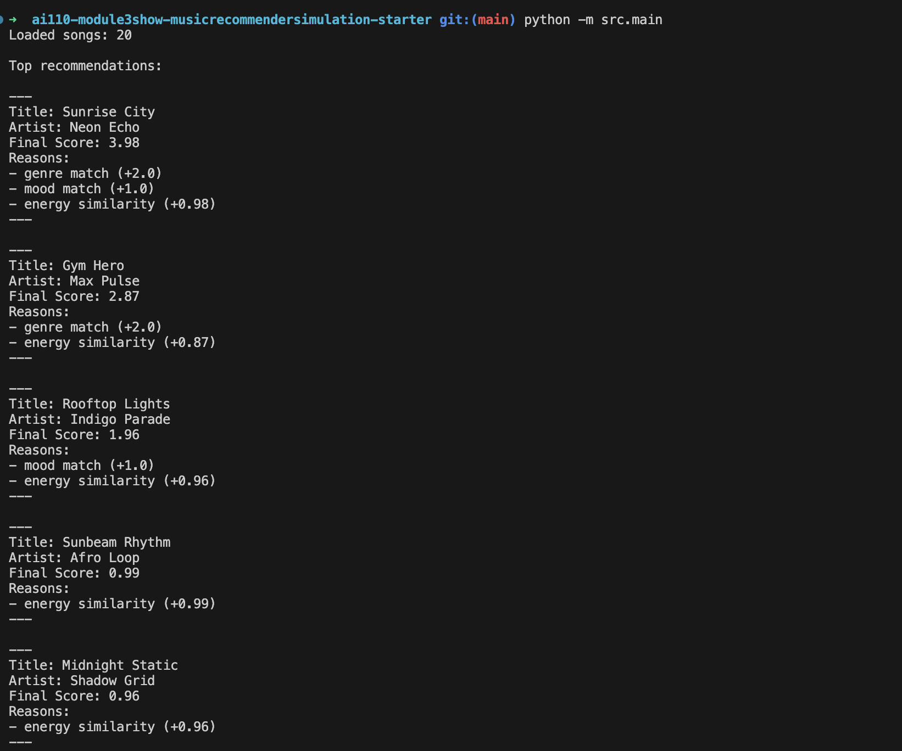
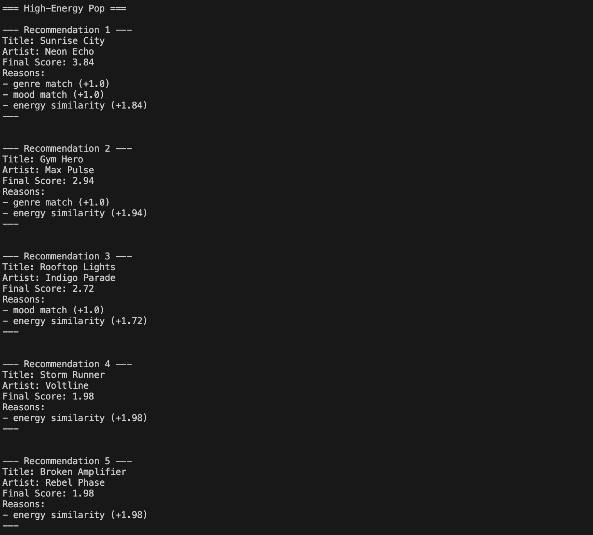
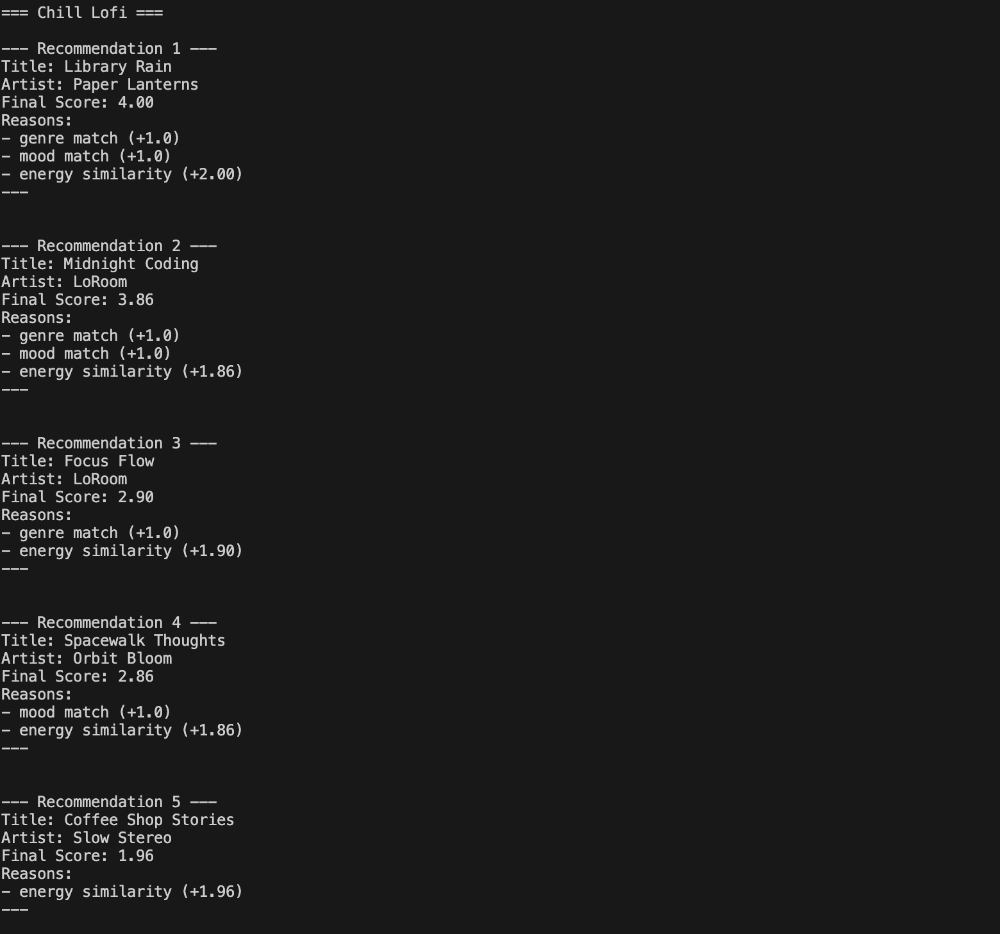
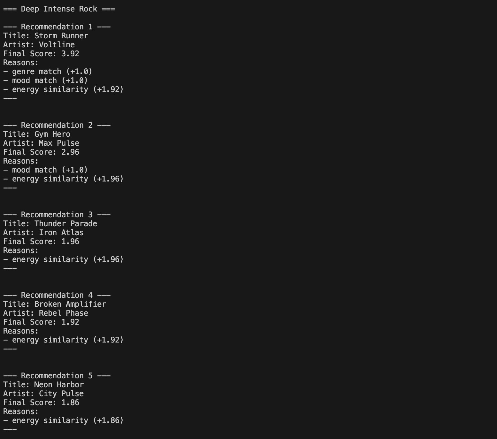
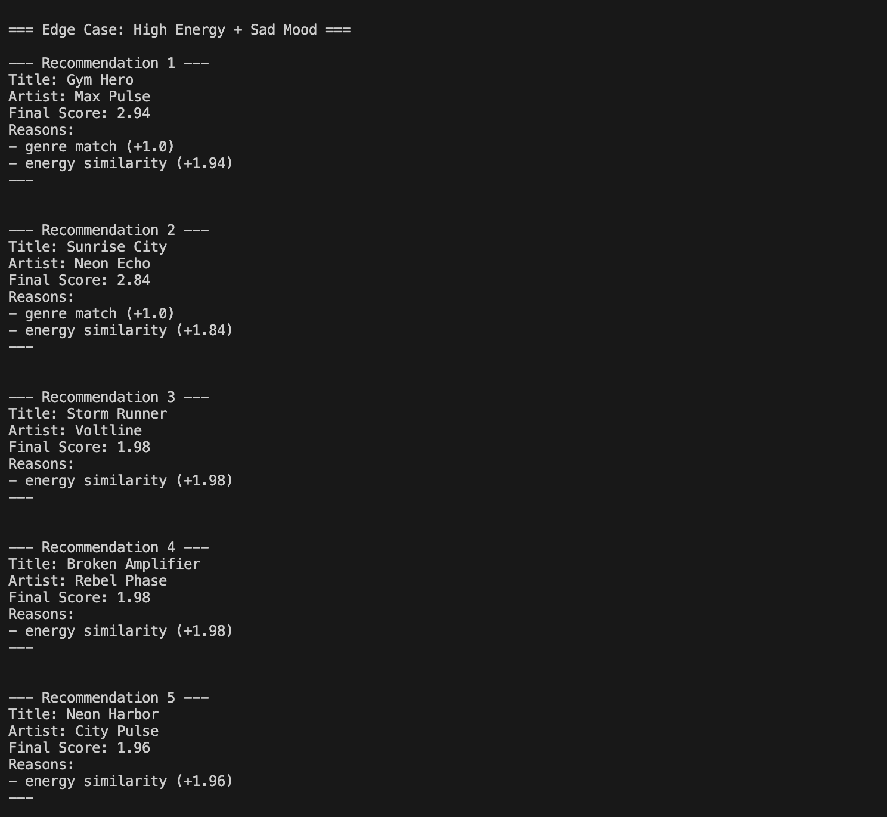
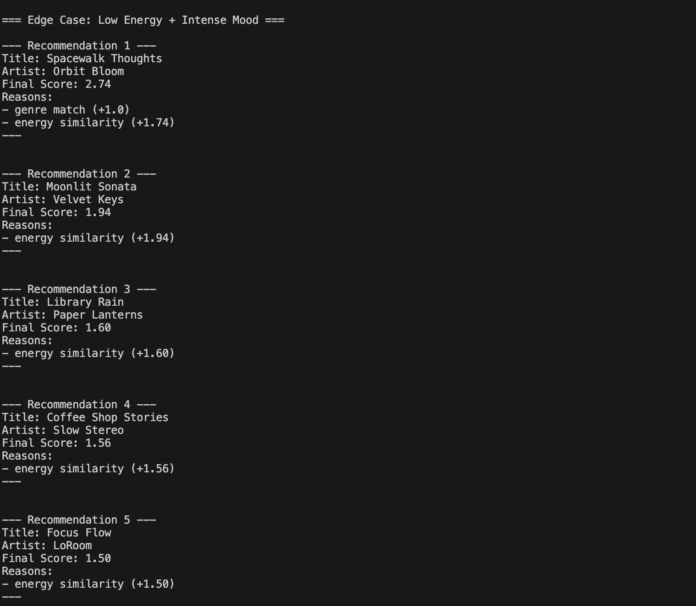

# 🎵 Music Recommender Simulation

## Project Summary

This project is a Python-based music recommendation engine that simulates how platforms like Spotify use content-based filtering. It uses a weighted scoring algorithm to match user 'vibe' preferences (energy, mood, tempo) against a song catalog, providing explainable results.

---

## How The System Works

Explain your design in plain language.

Some prompts to answer:

- What features does each `Song` use in your system
  - For example: genre, mood, energy, tempo
- What information does your `UserProfile` store
- How does your `Recommender` compute a score for each song
- How do you choose which songs to recommend

You can include a simple diagram or bullet list if helpful.

In real music platforms, recommendations usually blend collaborative filtering, which learns from many users' listening patterns, with content-based filtering, which compares item attributes like mood and energy. My version will prioritize content-based features so it can recommend songs that match a user's current vibe even when there is little or no listening history. The recommender will score each song by comparing its attributes to the user profile, then rank the highest-scoring songs first.

## Algorithm Recipe

The final scoring system gives points for both exact matches and close numeric matches:

- Exact genre match: `+3`
- Exact mood match: `+4`
- Energy similarity: `+5 * max(0, 1 - abs(target_energy - song_energy))`
- Tempo similarity: `+2 * max(0, 1 - abs(target_tempo_bpm - song_tempo_bpm) / 200)`
- Valence similarity: `+2 * amax(0, 1 - abs(target_valence - song_valence))`
- Acousticness similarity: `+1 * max(0, 1 - abs(target_acousticness - song_acousticness))`

This keeps mood and energy more important than genre, which helps the system recommend songs by vibe instead of only by category.

One potential bias is that if genre points are too high, the recommender may over-prioritize genre and miss songs that match the user's mood or energy better. Another risk is that the model can favor high-energy tracks if those weights are dominant, so the balance between categorical and numeric features needs to stay intentional.

**Song attributes used from `data/songs.csv`**

- `id`
- `title`
- `artist`
- `genre`
- `mood`
- `energy`
- `tempo_bpm`
- `valence`
- `danceability`
- `acousticness`

**UserProfile attributes used in the recommender**

- `favorite_genre`
- `favorite_mood`
- `target_energy`
- `likes_acoustic`

## Screenshots

### Phase 3 Baseline Test

This screenshot shows the earlier Phase 3 output before the multi-profile test loop was added.



### Profile Test: High-Energy Pop

This test shows how the recommender ranks upbeat pop tracks for a user who wants high energy and a happy mood.



### Profile Test: Chill Lofi

This test shows how the recommender handles a lower-energy, more relaxed lofi target.



### Profile Test: Deep Intense Rock

This test shows how the recommender responds to a heavier rock profile with intense energy.



### Edge Case Test: EC1

This screenshot shows an adversarial profile that combines high energy with a conflicting mood preference.



### Edge Case Test: EC2

This screenshot shows a second adversarial profile that pushes the scoring logic in a different direction.



---

## Getting Started

### Setup

1. Create a virtual environment (optional but recommended):

   ```bash
   python -m venv .venv
   source .venv/bin/activate      # Mac or Linux
   .venv\Scripts\activate         # Windows

   ```

2. Install dependencies

```bash
pip install -r requirements.txt
```

3. Run the app:

```bash
python -m src.main
```

### Running Tests

Run the starter tests with:

```bash
pytest
```

You can add more tests in `tests/test_recommender.py`.

---

## Experiments You Tried

Use this section to document the experiments you ran. For example:

- What happened when you changed the weight on genre from 2.0 to 0.5
- What happened when you added tempo or valence to the score
- How did your system behave for different types of users

---

## Limitations and Risks

Summarize some limitations of your recommender.

Examples:

- It only works on a tiny catalog
- It does not understand lyrics or language
- It might over favor one genre or mood

You will go deeper on this in your model card.

---

## Reflection

Read and complete `model_card.md`:

[**Model Card**](model_card.md)

Write 1 to 2 paragraphs here about what you learned:

- about how recommenders turn data into predictions
- about where bias or unfairness could show up in systems like this

---
